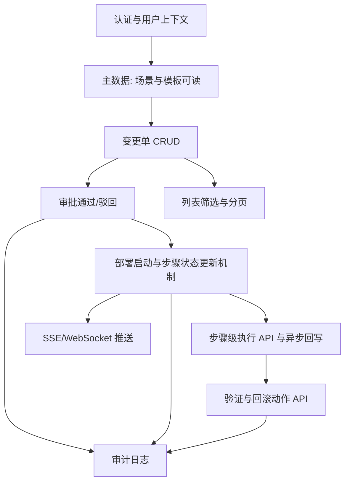

# 变更单管理 — 后端接口开发清单与依赖顺序

本文档与 [`API.md`](./API.md) 配套，用于排期与分工；**数字阶段表示建议实现顺序**，同阶段内条目可按人力并行，但需满足「依赖」列。

---

## 依赖关系总览

说明：**主数据（部署场景、部署模板）** 若由其他团队交付，变更单服务在联调前至少需要「按 ID 校验存在性」的读接口或本地同步数据。

---

## 阶段 0：前置（与变更单并行，联调前必须就绪）

| 序号 | 任务 | 说明 | 依赖 |
|------|------|------|------|
| 0.1 | 统一认证 | JWT / SSO，`creator`、`operator` 从令牌解析 | 无 |
| 0.2 | 错误码与 `Problem+json` 风格 | 与 `API.md` 1.3 一致 | 无 |
| 0.3 | 部署场景只读校验 | `GET /deployment-scenarios/{id}` 或内部 RPC，用于校验 `scenarioIds` | 0.1 |
| 0.4 | 部署模板只读校验 | `GET /deployment-templates/{id}` 或等价能力，用于校验步骤 `templateId` | 0.1 |

---

## 阶段 1：变更单核心读写（无审批、无执行）

| 序号 | 任务 | 对应 API | 依赖 |
|------|------|----------|------|
| 1.1 | 领域模型与持久化表结构 | `ChangeOrder` / `ChangeOrderStep` / 子步骤 JSON 或关联表 | 0.2 |
| 1.2 | 创建变更单 | `POST /change-orders`，服务端生成 `id`，默认 `status=approving`（或与产品确认草稿流） | 0.3、0.4、1.1 |
| 1.3 | 变更单详情 | `GET /change-orders/{id}` | 1.1 |
| 1.4 | 分页列表 | `GET /change-orders?page&pageSize` | 1.1 |
| 1.5 | 删除变更单 | `DELETE /change-orders/{id}`，定义允许删除的状态 | 1.1 |
| 1.6 | 部分更新（可选） | `PATCH /change-orders/{id}` | 1.1 |

**里程碑 M1**：可通过接口创建、查询、列表、删除变更单（静态数据联调）。

---

## 阶段 2：审批流

| 序号 | 任务 | 对应 API | 依赖 |
|------|------|----------|------|
| 2.1 | 审批通过 | `POST .../approval:approve`，`approving → deploying` | M1、0.1 |
| 2.2 | 审批驳回 | `POST .../approval:reject`，`approving → pending` | M1、0.1 |
| 2.3 | 审批记录落库 | 意见、操作者、时间（供审计） | 2.1、2.2 |

**里程碑 M2**：与 `ApprovalGateView` 联调通过。

---

## 阶段 3：编排执行内核（异步）

| 序号 | 任务 | 说明 | 依赖 |
|------|------|------|------|
| 3.1 | 任务队列或编排引擎对接 | 接收「开始部署」后拆解 `steps` | M2 |
| 3.2 | 步骤/子步骤状态回写 | Worker 更新 DB 中 `steps[].status`、`execute*` | 3.1 |
| 3.3 | 总状态聚合 | 全部成功 → `success`；任一步骤失败策略 → `failed` 或暂停 | 3.2 |
| 3.4 | 部署启动 API | `POST .../deployment:start`（若与审批合并则明确幂等语义） | 3.1 |

**里程碑 M3**：变更单从 `deploying` 能自动或半自动跑到终态（可先 Mock 流水线）。

---

## 阶段 4：步骤级操作 API

| 序号 | 任务 | 对应 API | 依赖 |
|------|------|----------|------|
| 4.1 | 主步骤 execute / interrupt / retry | `POST .../steps/{stepId}/actions:*` | M3 |
| 4.2 | 子步骤 execute / interrupt / retry | `POST .../sub-steps/{subStepId}/actions:*` | M3 |
| 4.3 | 与编排引擎映射 | API 触发 → 任务 ID → 异步回写 | 4.1、4.2 |

**里程碑 M4**：与 `ChangeOrderDeploymentView` 真实联动（替换纯前端提示）。

---

## 阶段 5：验证与回滚

| 序号 | 任务 | 对应 API | 依赖 |
|------|------|----------|------|
| 5.1 | 验证场景/节点执行 | `validation:executeScenario` / `executeItem` | M3 或 M4（视是否依赖部署完成） |
| 5.2 | 回滚执行 | `POST .../rollback:execute`，结合 `rollbackConfig.gate` | M3 |
| 5.3 | 回滚与审批联动 | `gate=approval_first` 时先走审批子流程 | 5.2、阶段 2 |

**里程碑 M5**：验证区与回滚区数据来自真实任务结果。

---

## 阶段 6：可观测与历史

| 序号 | 任务 | 对应 API | 依赖 |
|------|------|----------|------|
| 6.1 | SSE 或 WebSocket | `GET .../events` 或订阅接口 | M3 |
| 6.2 | 部署历史查询 | 复用列表加筛选 **或** `GET /deployment-records` | M3 |
| 6.3 | 全文搜索/时间筛选 | 扩展 `GET /change-orders` 查询参数 | 1.4 |

**里程碑 M6**：部署页可实时刷新；历史页数据对齐。

---

## 阶段 7：制品与扩展

| 序号 | 任务 | 对应 API | 依赖 |
|------|------|----------|------|
| 7.1 | 制品上传 | `POST .../artifacts`，对象存储 | M1 |
| 7.2 | 步骤绑定 artifactId | 更新 `deploymentPackage` 或新字段 | 7.1 |

---

## 建议排期顺序（一句话）

**0 → 1 → 2 → 3 → 4 → 5 → 6 → 7**

- **必须先于**变更单联调：**0（认证 + 场景/模板校验）**。  
- **必须先于**执行类接口：**3（异步回写能力）**，否则步骤 API 无意义。  
- **审计（2.3）** 可与阶段 2 同步；完整审计建议在阶段 3 后把执行事件也纳入。

---

## 与前端原型差异说明（联调时注意）

| 点 | 说明 |
|----|------|
| 场景/模板 | 前端 `ScenarioManager` 内编辑与 `constants` 可能不一致；后端应以服务端主数据为准 |
| 列表搜索/筛选 | 当前 UI 为占位，接口按 `API.md` 实现即可 |
| 部署执行按钮 | 前端部分为演示，接入后以 `GET` 详情 + SSE 刷新为准 |

---

## 文档版本

| 版本 | 日期 | 说明 |
|------|------|------|
| 1.0 | 2026-04-19 | 初版 |
